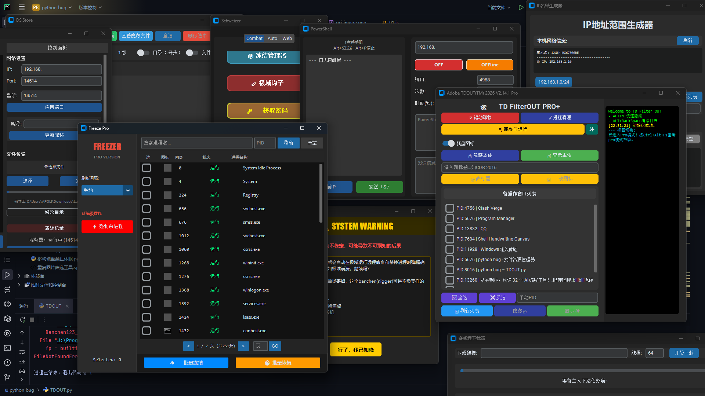

<div align="center">


```
  ▄▄▄█████▓▓█████▄  ▒█████   █    ██ ▄▄▄█████▓
  ▓  ██▒ ▓▒▒██▀ ██▌▒██▒  ██▒ ██  ▓██▒▓  ██▒ ▓▒
  ▒ ▓██░ ▒░░██   █▌▒██░  ██▒▓██  ▒██░▒ ▓██░ ▒░
  ░ ▓██▓ ░ ░▓█▄   ▌▒██   ██░▓▓█  ░██░░ ▓██▓ ░ 
    ▒██▒ ░ ░▒████▓ ░ ████▓▒░▒▒█████▓   ▒██▒ ░ 
    ▒ ░░    ▒▒▓  ▒ ░ ▒░▒░▒░ ░▒▓▒ ▒ ▒   ▒ ░░   
      ░     ░ ▒  ▒   ░ ▒ ▒░ ░░▒░ ░ ░     ░    
    ░       ░ ░  ░ ░ ░ ░ ▒   ░░░ ░ ░   ░      
              ░        ░ ░     ░              
            ░                                 
```

</div>

---

<div align="center">

### <span style="color: red;">作弊请按 Ctrl + Alt + L</span>

</div>

---
### 📦 安装依赖
```bash
pip inastall customtkinter psutil requests pywin32 keyboard winotify pystray Pillow colorama
```

### 📦 打包为exe

> 需要先安装 `pyinstaller `

```bash
pip install pyinstaller 
```

### TDOUT 打包
```bash
pyinstaller --clean --onefile --noconsole -i ".\003.ico" -n "Adobe™ TDOUT®" --add-data "NTDHider32.dll;." --add-data "NTDShower32.dll;." --add-data "Banchen123.ico;." --add-data "p.ps1;." --exclude-module numpy.testing --exclude-module setuptools --exclude-module pip --exclude-module distutils ".\TDOUT.py"
```
> 提示:TDOUT打包完成后需将程序exe移到项目根目录以打包TDOUTN
### TDOUTN 打包

```bash
pyinstaller --clean --onefile -i ".\hacker.ico" -n "TDOUTN" --add-data "Adobe™ TDOUT®.exe;." --exclude-module numpy.testing --exclude-module setuptools --exclude-module pip --exclude-module distutils ".\TDOUTN.py"
```

---

```text
╔═════════════════════════════════════════════════════╗
║                📂 TDOUT 项目结构                    ║
╚═════════════════════════════════════════════════════╝
TDOUT/
├── [ICON] 002.ico                   老图标
├── [ICON] 003.ico                   新图标
├── [ICON] Banchen123.ico            托盘(内阁)图标
├── [ICON] hacker.ico                TDOUTN(黑掉)图标
├── [SCRIPT] Low-key‘s hacker -little.bat  附件(最短的解控指令)
├── [DLL] NTDHider32.dll             DLL隐藏注入模块
├── [DLL] NTDShower32.dll            DLL显示注入模块
├── [DOC] README.md                  91
├── [PY] TDOUT.py                    TDOUT主程序
├── [PY] TDOUTN.py                   TDOUT启动器
├── [DLL] uiaccess.dll               权威置顶模块
├── [TXT] 打包命令.txt
│
├─ 🛡️ combat  ── 权威小工具
│  ├── [PY] Hook.py                  真得好好控制一下极域了
│  ├── [PY] NSudo.py                 提权小工具
│  ├── [PY] WindowsClean.py          窗口透明度调整小工具
│  │
│  └─ 📡 UDP  ── 低调的黑壳有多可怕 UDP工具
│         ├── [PY] attackCore.py     数据包存放位置
│         ├── [PY] UDP_Attack.py     主界面
│         └── [PY] Ui_UDPAttack.py   F1子窗口存放位置
│
└─ 🧩 modules  ── 子工具集
    ├── [PY] clean.py                清理空文件夹的小工具
    ├── [PY] Download.py             多线程下载器
    ├── [PY] eeg.py                  内阁要求的
    ├── [PY] F1.py                   帮助目录
    ├── [PY] Freeze.py               冻结管理器
    ├── [PY] IP.py                   方便一键生成IP清单的小工具
    ├── [PY] lan_transfer_chat.py    局域网聊天工具
    ├── [PY] subwindow_panel.py      瑞士军刀
    └── [PY] tools.py                键鼠解禁(貌似没啥用)
```

---

<div align="center">



# <span style="color: green;">TDOUT 2026 Pro</span>

> **BY APOLI**

> 具备先进功能的进程驱动及其网络操作工具，开发由最初的 bat 脚本发展为现在的图形化操作界面

     

</div>

---

## ⌨️ 快捷键

| 快捷键 | 功能 |
|---|---|
| <kbd>Ctrl</kbd> + <kbd>Alt</kbd> + <kbd>L</kbd> | 切换模式 |
| <kbd>Ctrl</kbd> + <kbd>Backspace</kbd> | 清除日志 |
| <kbd>Alt</kbd> + <kbd>N</kbd> | 隐藏 / 还原（后台有效） |
| <kbd>Ctrl</kbd> + <kbd>Shift</kbd> + <kbd>Z</kbd> + <kbd>K</kbd> | 杀死极域进程（后台有效） |
| <kbd>Shift</kbd> + <kbd>Alt</kbd> + <kbd>S</kbd> | 隐藏当前活动窗口（后台有效） |
| <kbd>Ctrl</kbd> + <kbd>Alt</kbd> + <kbd>h</kbd> | 黑客工具 |
| <kbd>Ctrl</kbd> + <kbd>Alt</kbd> + <kbd>F1</kbd> | 打开帮助窗口 |
| <kbd>Ctrl</kbd> + <kbd>Alt</kbd> + <kbd>F2</kbd> | 多功能工具箱 |
| <kbd>Ctrl</kbd> + <kbd>Alt</kbd> + <kbd>F3</kbd> | 局域网通讯工具 |
| <kbd>Ctrl</kbd> + <kbd>Alt</kbd> + <kbd>F4</kbd> | IP 名单生成工具 |
| <kbd>Ctrl</kbd> + <kbd>Alt</kbd> + <kbd>F5</kbd> | 空文件夹清理工具 |
| <kbd>Ctrl</kbd> + <kbd>Alt</kbd> + <kbd>F6</kbd> | 进程冻结管理器 |
| <kbd>Ctrl</kbd> + <kbd>Alt</kbd> + <kbd>F7</kbd> | 多线程下载器 |

> **注意：** 不要重复启动程序（后台运行中再次打开可能导致局域网聊天异常）,退出程序后检查托盘判断是否在后台运行;如果快捷键失效请检查**大写锁定**。
本软件已内置全屏解控`每五秒检测一次`,但存在问题,解开后键盘失效`目前尚未解决`

---

## 一、作者的话
这个工具打开有两种模式,以防止被制裁

- **伪装模式（Decoy Mode）**：展示"系统修复"界面迷惑观察者，按钮仅输出模拟日志。
- **PRO 模式（Advanced Mode）**：DLL 注入、批量窗口管理、TD Filter / StudentMain 等核心操作。

这个工具使用了大量的伪装语言,加上一直是作者以及几个同学自用的,所以有些ui看不懂是正常的,不过看帮助大致也知道是什么意思(虽然大部分是叫ai写的)

这个工具基本上已经停止维护了,因为作者已经毕业了.你如果有想法的话欢迎Issues,有时间会看看

F1帮助界面的信息会比这个界面里的详细些,第一次使用这个软件建议看看

与其说是极域工具箱,不如说是系统工具箱,因为其实真正对抗极域的没几个哈哈,因为作者的机房环境里没有管理助手,所以强度会低很多

---

## 二、视图切换与系统托盘

- **切换模式：** <kbd>Ctrl</kbd> + <kbd>Alt</kbd> + <kbd>L</kbd> — PRO 模式 ⇌ 伪装模式
- **关闭到托盘：** 点击 [X] 最小化到系统托盘后台运行
  - 双击图标恢复窗口，右键图标选择"退出程序"

---

## 三、伪装模式

默认视图，模拟系统修复工具。cdr修复可以修复老版cdr打不开的问题，其他按钮仅输出日志，不执行实际操作。

---

## 四、PRO 模式

<kbd>Ctrl</kbd> + <kbd>Alt</kbd> + <kbd>L</kbd> 切换至此模式。

- **清除日志：** <kbd>Alt</kbd> + <kbd>Backspace</kbd>
- **快捷呼出：** <kbd>Alt</kbd> + <kbd>N</kbd>

### 核心驱动和进程清理

- **💥 TD FILTER 驱动卸载：** 解网解U盘
- **🧹 STUDENTMAIN 进程清理：** 强制终止 `StudentMain.exe` — <kbd>Ctrl</kbd> + <kbd>Shift</kbd> + <kbd>Z</kbd> + <kbd>K</kbd>（后台可用）
- **=] 部署与运行：** 已经废弃的功能
- **✨ 高调模式：** 启动 5 个 `cmd.exe` 并运行 `dir /s` 直接感受低调的黑科

### DLL 注入（窗口隐藏 / 显示）

让本程序在极域教师监控中消失。

- **🔒 注入隐藏 DLL：** 隐藏当前前台窗口
- **🔓 注入显示 DLL：** 恢复被隐藏的窗口

### 批量窗口管理

1. **刷新列表**：获取所有可见窗口
2. **窗口列表**：PID + 标题，CheckBox 选择
3. **全选 / 反选**
4. **批量操作**（<kbd>Shift</kbd> + <kbd>Alt</kbd> + <kbd>S</kbd> 快速隐藏当前窗口，后台有效）：
   - 隐藏选中 👻 / 显示选中 ✨
   - 批量设置标题 📝
   - 批量设置图标 🖼️

---

## 五、日志控制台

| 标识 | 颜色 | 含义 |
|---|---|---|
| `[√]` | 绿色 | 成功 |
| `[X]` | 红色 | 失败（含错误码） |
| `[→]` | 黄色 | 执行中 / 警告 |
| `---` | 白色 | 一般信息 |

---

## 六、忠告

仅供参考学习，使用时注意周边安全，牢记 <kbd>Ctrl</kbd> + <kbd>Alt</kbd> + <kbd>L</kbd> 和 <kbd>Alt</kbd> + <kbd>N</kbd>！

---

## 七、多功能页面

 <kbd>Ctrl</kbd> + <kbd>Alt</kbd> + <kbd>F2</kbd> 弹出（v2.5 新增）。

---

## 八、局域网互传与聊天工具

 <kbd>Ctrl</kbd> + <kbd>Alt</kbd> + <kbd>F3</kbd> 弹出（窗口显示不完整时可手动拉大，v2.7 新增）。

Python 跨平台桌面应用，基于 TCP 实现同一局域网内 P2P 实时聊天与文件传输（每个实例同时作为服务端和客户端）。

- **聊天：** 文本发送、彩色日志、自动保存到 `LanChat_history.txt`
- **文件传输：** 文件选择 → 进度条 → TCP 可靠传输，接收文件自动保存到 `~/Downloads/LanReceived`
- **配置：** 自动检测本机 IP 和端口，可更改监听端口，手动设置目标 IP:端口（支持逗号多发），Name 配置发送者名称

**连接方式：** 双端启动程序，A 端目标 IP 填 B 端本地 IP + 监听端口（默认 `14514`），B 端同理。

---

## 九、IP 范围生成器

 <kbd>Ctrl</kbd> + <kbd>Alt</kbd> + <kbd>F4</kbd> 弹出（v2.9 新增）。

- **自动检测本机网络：** 识别主接口、私有 IP、链路本地地址、公网 IP，显示子网掩码及可用范围
- **支持格式：** CIDR (`192.168.1.0/24`)、范围 (`1-254` / `1.1-1.254`)、IP+掩码
- **快速填充：** 一键填充本机网络，内置常用网段预设
- **输出选项：** 排除网关（默认）、包含网络/广播地址，逗号分隔输出
- **应用场景：** 批量 ping、端口扫描、拓扑整理、脚本 IP 列表

---

## 十、clean 工具

 <kbd>Ctrl</kbd> + <kbd>Alt</kbd> + <kbd>F5</kbd> 弹出 — 批量清除空文件夹和 Mac 隐藏文件。

---

## 十一、冻结管理器

 <kbd>Ctrl</kbd> + <kbd>Alt</kbd> + <kbd>F6</kbd> 弹出（v2.10 新增）— 选择进程冻结或恢复。

---

## 十二、多线程下载器

 <kbd>Ctrl</kbd> + <kbd>Alt</kbd> + <kbd>F7</kbd> 弹出（v2.14 新增）— 自定义线程数，某些情况下比 IDM 还快。

---

## 十三、UDP重放攻击工具

 <kbd>Ctrl</kbd> + <kbd>Alt</kbd> + <kbd>k</kbd>或<kbd>h</kbd>`后台`*弹出*。详情见 [](https://github.com/AmedNet/JIYU_hacker_UDP)

---

## 🏅 特别鸣谢

- **banchen23**
- **CC**
- **深情淇少**

### 📦 参考与收录的开源项目

[](https://github.com/LYXOfficial/NoTopDomain) – DLL 注入和 UDP 工具参考  
[](https://github.com/shc0743/RunUIAccess) – 置顶功能采用  
[](https://github.com/youheng/NSudo) – 提权工具收录  
[](https://github.com/iwill123/Window2Clear) – 窗口透明度工具收录

---
